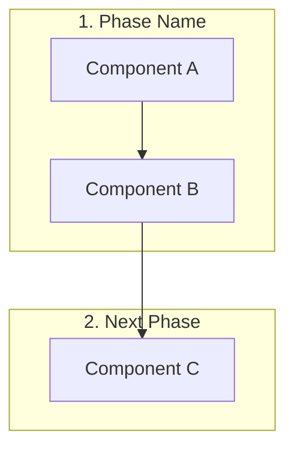

Create comprehensive technical documentation that explains the complete data flow for [FEATURE NAME].

## Output format:

### 1. Overview Section
- Provide a high-level description of the architecture
- Explain the key technologies and patterns used
- Summarize how data flows through the system

### 2. Sequence Diagram
Create a Mermaid sequence diagram showing:
- All actors and components involved
- Temporal order of interactions
- Message passing between components
- Loop constructs for iterative processes
- Key state changes

Use this format:
```mermaid
sequenceDiagram
    ...
```

### 3. Complete Data Flow Diagram
Create a Mermaid flowchart showing:
- All phases organized in subgraphs
- Component-level detail for each phase
- Connections showing data flow
- Clear numbering of phases (1, 2, 3...)

Use this format:


### 4. Detailed Component-by-Component Flow
For EACH phase and component, provide:

#### Phase N: [Phase Name] ([Brief Description])

**Component:** [ComponentName](path/to/file)

**Function:** `functionName(params)`

**Steps:**
1. Step description
2. Another step with code example if relevant

**Code Examples:**
```language
// Relevant minimal only essential code snippets. Skip if not essential.
const example = "value"
```

**State Changes:**
- `propertyName` → new value
- `anotherProperty` → description

**Data Structure Minimal Examples:**
```json
{
  "example": "data structure"
}
```

---

## Documentation Standards:

### Mermaid Diagrams
- Use quotes for paths: `["path/to/file"]`
- Keep labels simple (no HTML tags, no `<br>`)
- Use colons/commas to separate multi-line info
- Ensure proper subgraph organization

## Validation Checklist

- [ ] Sequence diagram and flow diagram render correctly
- [ ] Every component has file path reference
- [ ] Code examples are accurate, minial, essential, and current
- [ ] State transitions are clearly shown
- [ ] All file links work
- [ ] Error handling is documented
- [ ] Performance considerations are absent
- [ ] Future improvements are absent
